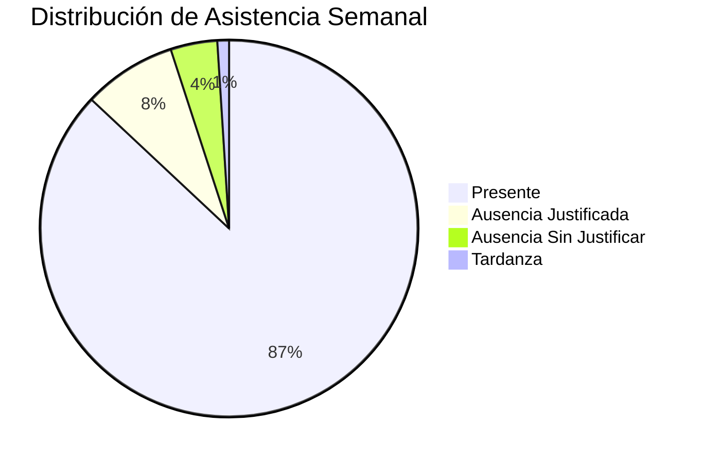
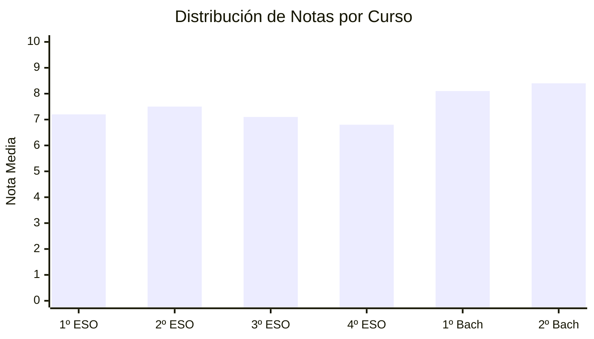

# 📊 Dashboard Principal - CotareloManage

Centro de control y monitoreo para la gestión educativa

## 🎯 Visión General

El dashboard principal de CotareloManage es el corazón del sistema, proporcionando una vista consolidada de toda la actividad educativa en tiempo real.

## 🚀 Características Principales

- Métricas en tiempo real
- Gráficos interactivos y personalizables
- Alertas y notificaciones inteligentes
- Acceso rápido a funciones clave
- Responsive para todos los dispositivos

## 📈 Métricas Principales

### Indicadores Clave de Rendimiento (KPIs)

| KPI                    | Valor Actual | Objetivo | Tendencia |
| ---------------------- | ------------ | -------- | --------- |
| Estudiantes Activos    | 1,247        | 1,500    | 📈 +5.2%  |
| Asistencia Promedio    | 87.3%        | 90%      | 📉 -1.1%  |
| Calificaciones Subidas | 94.7%        | 95%      | 📈 +2.3%  |
| Satisfacción Padres    | 4.6/5        | 4.5/5    | 📈 +0.2   |

## 📊 Widgets Disponibles

### Widget de Asistencia



### Gráfico de Calificaciones

El sistema muestra la distribución de calificaciones por curso:

#### Distribución de Notas por Curso



## 🔔 Sistema de Notificaciones

### Tipos de Alertas

#### Alertas Críticas 🚨

- Estudiante con más de 5 faltas consecutivas
- Calificación inferior a 3.0 en evaluación
- Incidencia disciplinaria grave
- Sistema con problemas técnicos

#### Alertas Importantes ⚠️

- Reunión de padres próxima
- Entrega de notas pendiente
- Evento escolar en 48 horas
- Backup automático fallido

## 👥 Vista por Roles

### Dashboard del Estudiante

Los estudiantes ven en su dashboard:

1. Próximas clases y horarios
2. Calificaciones recientes
3. Tareas pendientes y entregas
4. Eventos y comunicados
5. Progreso académico personal

### Dashboard del Profesor

Los profesores tienen acceso a:

- ✅ Resumen de sus clases
- ✅ Lista de estudiantes por materia
- ✅ Calificaciones pendientes de subir
- ✅ Materiales educativos recientes
- ✅ Comunicaciones con padres

### Dashboard del Administrador

Vista completa del sistema:

> **Importante:** Este dashboard contiene información sensible y debe protegerse adecuadamente.

### Permisos Granulares

```json
{
  "roles": {
    "student": {
      "dashboard": ["view_own", "export_grades"],
      "widgets": ["grades", "schedule", "assignments"]
    },
    "teacher": {
      "dashboard": ["view_classes", "manage_grades"],
      "widgets": ["class_overview", "student_progress", "communications"]
    },
    "admin": {
      "dashboard": ["view_all", "system_metrics"],
      "widgets": ["*"]
    }
  }
}
```

## 💡 Consejo

Personaliza tu dashboard para mostrar solo la información que necesitas ver frecuentemente.

¿Necesitas ayuda configurando tu dashboard? Visita nuestra guía de personalización.

**Dashboard inteligente para educación moderna** 📊
