# 🔐 Sistema de Autenticación - Login

Portal de acceso seguro para **CotareloManage**

---

## 🎯 Descripción del Módulo

El sistema de login de CotareloManage proporciona autenticación segura mediante **JWT (JSON Web Tokens)** y soporta múltiples métodos de acceso.

---

## 🛡 Características de Seguridad

- Encriptación **AES-256** para contraseñas
- Tokens **JWT** con expiración automática
- Autenticación de **dos factores (2FA)** opcional
- Protección contra ataques de fuerza bruta
- Auditoría completa de accesos

---

## 🚪 Métodos de Autenticación

| Método         | Disponibilidad  | Seguridad     | Facilidad    |
| -------------- | --------------- | ------------- | ------------ |
| Email/Password | ✅ Siempre      | 🔒 Alta       | 😊 Fácil     |
| Google SSO     | ✅ Configurado  | 🔒🔒 Muy Alta | 😍 Muy Fácil |
| Microsoft SSO  | 🔄 Próximamente | 🔒🔒 Muy Alta | 😍 Muy Fácil |
| LDAP/AD        | ⚙ Empresarial   | 🔒🔒🔒 Máxima | 🤔 Técnica   |

---

## 👥 Tipos de Usuario

### Estudiantes

Los estudiantes tienen acceso a:

1. Calificaciones y notas
2. Horarios de clase
3. Material educativo
4. Comunicación con profesores
5. Tareas y entregas

### Profesores

Los profesores pueden:

- ✅ Gestionar sus clases
- ✅ Subir calificaciones
- ✅ Comunicarse con estudiantes y padres
- ✅ Crear contenido educativo
- ✅ Generar reportes académicos

### Administradores

Los administradores tienen control total:  
⚠️ _Importante: Los permisos de administrador deben asignarse con extrema precaución._

- 🔧 Gestión completa de usuarios
- 🔧 Configuración del sistema
- 🔧 Backup y restauración
- 🔧 Monitoreo y estadísticas
- 🔧 Soporte técnico

---

## 🔄 Flujo de Autenticación

```mermaid
sequenceDiagram
    participant U as Usuario
    participant F as Frontend
    participant A as API Auth
    participant D as Database
    participant R as Redis

    U->>F: Introduce credenciales
    F->>A: POST /auth/login
    A->>D: Verificar usuario
    D-->>A: Datos usuario
    A->>R: Almacenar sesión
    A-->>F: JWT Token + User Info
    F-->>U: Redireccionar a dashboard

    Note over U,R: Usuario autenticado

    U->>F: Acceso a recurso protegido
    F->>A: GET /api/resource (Bearer Token)
    A->>R: Verificar sesión
    R-->>A: Sesión válida
    A-->>F: Recurso autorizado
    F-->>U: Mostrar contenido
```

---

## 📈 Estadísticas de Uso

### Horarios de Mayor Actividad

Los picos de login se producen:

1. **8:00-9:00 AM** - Inicio de clases
2. **2:00-3:00 PM** - Después del almuerzo
3. **7:00-8:00 PM** - Estudios en casa
4. **10:00-11:00 PM** - Revisión final

### Dispositivos Más Utilizados

- 📱 **Móvil:** 45%
- 💻 **Ordenador:** 35%
- 📱 **Tablet:** 15%
- 🖥 **Desktop:** 5%

---

## 🛡 Seguridad

⚠️ Nunca compartas tus credenciales. CotareloManage nunca te pedirá tu contraseña por email.

¿Problemas de acceso? Usa el **chat de soporte en vivo disponible 24/7**.

---

✨ Sistema de login seguro y confiable 🔐
